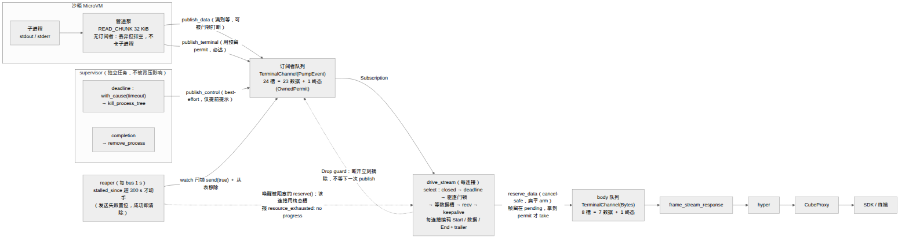
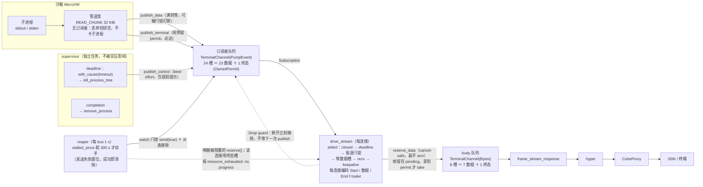
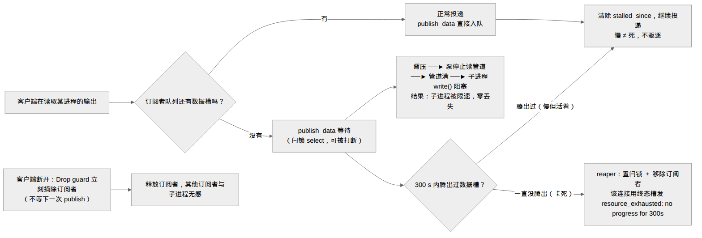
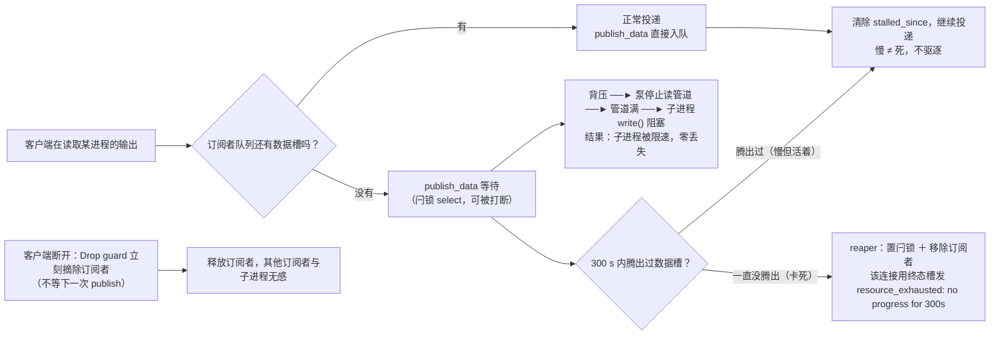
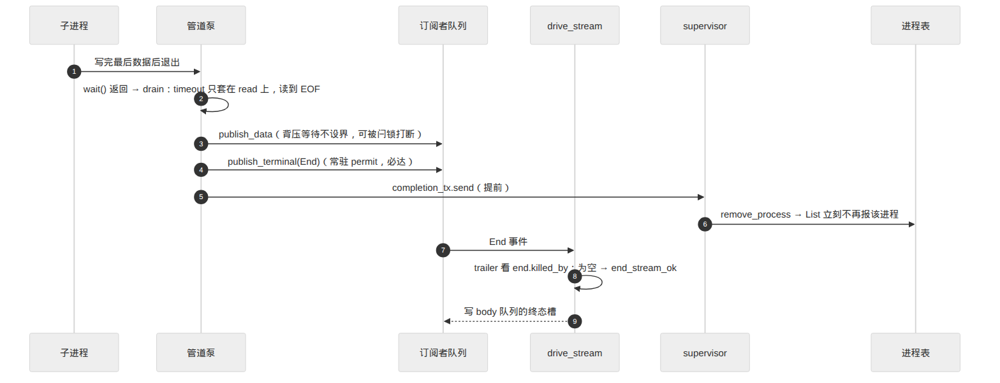
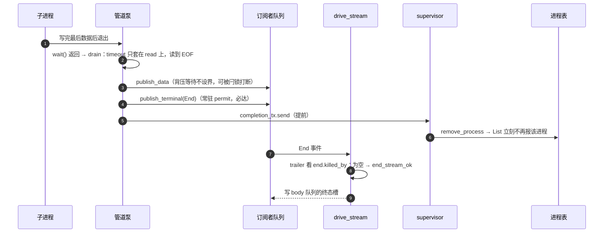
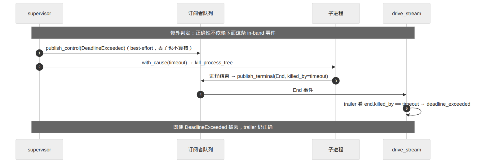
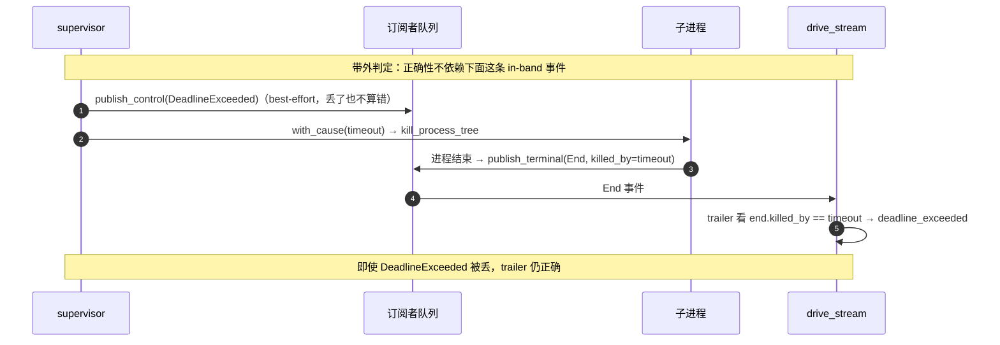

# 计划 v9：进程/PTY 输出改背压 + 进展式驱逐（八轮评审修订版 · 实现就绪）

> 修 "≥3 MiB 突发输出被截断"，同时不重演上游 [e2b-dev/runtime#3292](https://github.com/e2b-dev/runtime/issues/3292)
> 的"慢订阅者卡死整个 fan-out"。独立于 #25/#27。

## 修订记录

### v8 → v9（第八轮评审：严重度校准 + 1 个用例重定义 + 3 处小问题）

| 评审点 | v9 的处理 |
|---|---|
| **严重度校准**：v8 把 helper 丢帧写成"静默丢帧，违反 #11"**过重**——能击败 helper arm 的分支只有 1（`closed`）/2（`deadline`）/3（`evicted`），三者都**以显式错误结束流**，所以当前**没有可观察的数据丢失**；准确说法是 **cancel-safety 脆弱点**（帧在 await 前被移出状态；将来谁加一个"获胜但不结束流"的分支就会变成真正的静默丢帧） | v8→v9 修订记录与 §2.2 的措辞均改为准确表述；**扁平化仍然是正确修复**（消除脆弱点 + 删掉多余抽象） |
| **`cancelled_body_reserve_keeps_the_frame_in_pending` 不可断言**：新旧写法在该场景都以 `deadline_exceeded` 结束，"帧留在 pending"是内部状态，测不出差别 | §5 测试 6 拆成两条**可断言**用例：① `TerminalChannel` 单元级 cancel-safety（drop 未完成的 `reserve_data()` future → `capacity()` 恢复、下一次 `reserve()` 立即成功）；② 行为级（body 满 + 客户端停读 + deadline 到点 → 以 `deadline_exceeded` 结束、**绝不发 `end_stream_ok`**） |
| **3.1** §2.2 引导句残留"分支 4 是'等待+发送'的原子 helper"，与代码（扁平 arm + "不要写成 helper"注释）矛盾 | 改为"分支 4 只 `reserve`，帧留在 `pending`" |
| **3.2** §4 没写死 `try_send_data_frame` 的删除归属：commit 1 要保持行为等价就**必须保留**它（普通 `mpsc(64)` 无预留槽纪律时它是唯一安全阀） | §4 标注：**commit 2 才删除** `RESPONSE_QUEUE_CAPACITY` / `try_send_data_frame` |
| **3.3** "选 (B) 而非 (A)" 悬空（(A)/(B) 定义已不在文中） | §2.2 末条就地定义 (A)/(B) 并说明为何取 (B) |
| 性能面复核（维持第七轮结论，无新问题） | 已在 §7 记录 |

### v7 → v8（第七轮评审：1 条阻断 + 2 处实现级 + 2 处措辞/验收）

| 评审点 | 复核 | v8 的处理 |
|---|---|---|
| **阻断**：`send_data_or_evicted` 会丢帧——helper 是外层 `select!` 的 arm，别处分支获胜时 tokio **drop 掉该 future**，帧已 `take()` 进 helper 局部变量 → 随 future 一起丢，"放回 pending" 不执行。触发：客户端停读 + body 满 + stream deadline 到点 → 丢一帧尾部数据 | **成立，但严重度经第八轮校准**：能击败 helper arm 的分支只有 1/2/3，且三者都以**显式错误**结束流，故**当前不构成可观察的数据丢失**；它是 **cancel-safety 脆弱点**（帧在 await 前被移出状态——将来任何人加一个"获胜但不结束流"的分支就会变成真正的静默丢帧） | §2.2：**删掉 helper，扁平化**——`reserve_data()` 作为独立 arm，帧**留在 `pending`**，拿到 permit 后再 `pending.take()` 发送。`reserve()` 是 cancel-safe；输给别的分支时 permit 被 drop（槽自动归还）、帧不动。v6 担心的"双重 reserve"由"permit 握在手里再 send"天然消除 |
| **实现级 1**：`send_terminal(&mut self)` 过不了 `Arc<Subscriber>` —— `publish_terminal` 遍历快照只有 `Arc<Subscriber>`，取不到 `&mut q` | **成立** | `TerminalChannel.terminal` 改为 **`Mutex<Option<OwnedPermit<T>>>`**，`send_terminal(&self)` 内部 `take()`（同步、不跨 await），`Arc` 下可用 |
| **实现级 2**：§4 说 `body_channel()` 返回含常驻 permit 的 `TerminalChannel`，§8 说 commit 1 用普通 `mpsc(64)` —— 到底哪个 commit 引入没写死 | 成立 | §4 标注**引入 commit**；§8 写死：**commit 1 = 普通 `mpsc(64)`（两队列，无预留槽纪律）**，**commit 2 = `TerminalChannel` + 常驻 `OwnedPermit`（23+1 / 7+1）** |
| **措辞/验收**：#4 "其他订阅者不受影响"过强——对"已驱逐"成立，对"**慢但活着**"不成立：有界缓冲 + 零丢失 + 单管道下，最慢订阅者会 pacing 整条流（固有，Go 同样如此且更糟）；停读窗口内其他订阅者只剩各自 ~1 MiB 缓冲 | 成立 | §0 #4 收窄为"**对已断开/已驱逐者**成立"；§6 风险表新增一行"**最慢订阅者 pacing 整条流**"，与"慢消费者拖慢子进程"并列 |
| **措辞**：§2.3 "该订阅者必然是已被 reaper 驱逐"的论证依赖 `SpawnError` 与 `End` **互斥**（否则双终态争唯一 permit） | 成立 | §2.3 写明该前提：每个进程只会发布**一个**终态（`End` 或 `SpawnError`），故 permit 只被消费一次 |

> 图 1–4 保留在「图示（先看图）」一节；本轮只更新**图 1** 的一条边标签（helper 已删）。

### v6 → v7（第六轮评审：1 条阻断 + 4 处中等 + 文档串号）

| 评审点 | 复核 | v7 的处理 |
|---|---|---|
| **1.1** `capacity()+try_reserve` 只解决"检查"没解决"**等待**"：要背压就得用 `reserve()`，而它会拿走任意释放的槽（很可能就是终态槽）；"先判 `capacity()>1` 再 `reserve()`"同样失守 | **成立**（这是 v3→v6 一直没点破的能力缺口；现状能用 `capacity()<=1` 是因为它**从不等待**） | §2.2：采用 **`OwnedPermit` 常驻预留**——建队列时 `tx.clone().try_reserve_owned()` 拿一个 permit **永久握在手里**（它占掉一个槽，使 `capacity()` 少 1、数据 `reserve()` 永远碰不到它）；数据走 `tx.reserve().await`（可被闩锁打断），终态走 `terminal_permit.take().unwrap().send(frame)`。**这才是强制**，且接收端仍是普通 `mpsc::Receiver`（无需配合）。tokio 1.53.1 已确认：`try_reserve_owned` / `OwnedPermit::send` 可用 |
| **1.2** §2.2 分支 4 自相矛盾：`body_has_data_room` 若"等到有位置"就已拿 permit，紧接 `send_data` 会看到容量少 1；`pending.take()` 在 fallible send 之前（Err 时帧已丢）；`is_err()` 把 `Full`（该等）与 `Closed`（该断）混为一谈 → **任何 Full 都会断流** | **成立，且正好是本 PR 要消灭的行为** | §2.2：分支 4 改为**一个原子 helper**（等待+发送合一），错误分档 `Fatal::{Closed, Evicted}`；并用 `reserve()`（**不会返回 Full**，只会在 receiver drop 时 `Err`） |
| **2.1** `publish_terminal` "跳过并记日志"的理由写错：缓存/晚 attach 兜的是**另一个**连接，被跳过的**当前**活订阅者会一直等 | 成立 | §2.3：改为"跳过只发生在**已被驱逐**的订阅者上，其 trailer 由 `drive_stream` 的驱逐分支负责" |
| **2.2** `publish_control` 是**另一个任务**（supervisor），与泵并发 → "单生产者无窗口"的论证只覆盖数据，控制事件仍可能吃掉终态槽 | 成立 | `OwnedPermit` 一并解决：预留槽**根本不进入 `capacity()` 口径**，控制事件最多占一个**数据**槽（最坏让数据等一帧），永远偷不走终态槽 |
| **2.3** 每帧每订阅者 `watch::Sender::subscribe()`（`yes` 场景 ~30k 帧/s × N） | 成立 | §2.4：泵侧在 `Subscriber` 里**缓存一份** `watch::Receiver<bool>`；`Subscription` 另持一份只给 `drive_stream` |
| **2.4** §2.3 "终态兜底不阻塞" 措辞不准 | 成立 | 改为"**不阻塞生命周期路径**（只等数据槽，最坏一个阈值后由驱逐解开）" |
| 文档串号：§2 标题仍写 v5、§3 表头 "v5 之后"、§2.8 "v5 的表述"、§1.2 "四轮"、helper 名不一致 | 成立 | 全部改为 v7 / 六轮，helper 统一为 `send_data_or_evicted` |

### v5 → v6（第五轮评审：3 条阻断 + 3 处中等）

| 评审点 | 复核 | v6 的处理 |
|---|---|---|
| **1.1** `ReservedQueue` 的信号量**不强制**预留槽：permit 在 `send_data` 返回（即 `send` 之后）就归还，队列仍能装 24 条数据；而"permit 随 item 出队归还"又要求接收端释放 permit，与 `mpsc::Receiver<PumpEvent>` / `ReceiverStream<Bytes>` 冲突 | **成立**：我 v5 那句"信号量是强制、check 是检查"的论证是错的 | §2.2：**放弃信号量**，回到"检查 `capacity() > 1` + `try_reserve()`"（**该写法在 v7 被判定"只检查不等待"而改用 `OwnedPermit`**，见上表 1.1）。**单生产者论证**：订阅者队列的数据生产者只有管道泵一个任务（`publish_data`/`publish_terminal` 串行），body 队列只有该连接的 `drive_stream` 一个 ⇒ check 与 reserve 之间没有并发窗口。并写明 `publish_control` 允许临时占用终态槽（终态槽不保证对控制事件保留） |
| **1.2** `Notify + notify_waiters` 的"先查标志再等"仍有丢唤醒窗口（check 与 register 之间通知已发出 → 永不唤醒），#15 在竞态下失效 | **成立** | §2.4：改用**闩锁** `tokio::sync::watch<bool>`（`*rx.borrow()` 读当前值 + `rx.changed()` 对"已变"和"之后才变"都能唤醒）。仓库已在 `filesystem/watch/mod.rs:179-241` 用同一手法，无新增依赖（`tokio` 为 `features=["full"]`，且仓库**没有** `tokio-util`，故不用 `CancellationToken`） |
| **1.3** `deadline` future 若每轮重建 `sleep` 则永不到期（#16 换个形态复发） | **成立** | §2.2：保留现状结构（`pump.rs:48-53`）——循环**外**创建并 `tokio::pin!`，循环内 `_ = &mut deadline, if deadline_enabled`；§4 `pump.rs` 行点明"保留 pin 结构" |
| **2.1** `publish_terminal` 的兜底 `reserve().await` 不监听驱逐，卡死订阅者上会等满一个阈值 | 成立 | §2.3：兜底也走**闩锁 select**（与 §2.4 同形）；若仍拿不到则**跳过该订阅者并记日志**（终态由 `terminal` 缓存 + 晚 attach 兜底） |
| **2.2** `publish_control` 的 `try_send` 可能占用终态槽 | 成立 | §2.2/§2.3 明写"控制事件允许占用终态槽；预留只针对**数据**" |
| **2.3** keepalive 被 `!deadline_seen` 门控与现状不同（现状只门控 deadline） | 成立 | §2.2：**恢复现状语义**——keepalive 只受 `pending.is_none()` 门控；`deadline` 才受 `!deadline_seen` 门控 |
| 次要：commit 1 不该带预留槽语义、类型不匹配、测试 6 与 1.1 对齐 | 成立 | §8：commit 1 用**普通 `mpsc(64)`（无预留槽纪律）**，commit 2 才引入"数据少用一槽 + 终态用末槽"；§5 测试 6/14/15/17 措辞对齐 |

### v4 → v5（第四轮评审：2 条阻断 + 4 处必须钉死的实现细节）

| 评审点 | 复核 | v5 的处理 |
|---|---|---|
| **1.1** reaper "drop/close tx" 解不开 `publish_data` 已挂起的 `reserve()`：pump 手里那份 `Arc`/clone `Sender` 让 channel 保持 open → 卡死依旧 | **成立**：`v4` 把 v3 的 `gone: Notify` 删掉是错的 | §2.4：`Subscriber` 加可打断句柄；`publish_data` 用 `select!` 等待**可被通知打断**，被打断即跳过该订阅者（v5 选 `Notify`，**v6 换成 `watch` 闩锁**，见上表 1.2） |
| **1.2** `biased` 下 `events.recv()` 排在 `deadline` 前 → 持续输出时后续分支**永不被 poll**，`Sleep` 不推进 → 连接级 deadline 永不触发 | **成立**（现状 `next_delivery` 是非 biased，故无此问题） | §2.2：保留 `biased` 但**重排**为 `closed → deadline → evicted → body reserve → recv → keepalive`；deadline 排在 recv 之前，每轮必被 poll |
| **2.1** 预留终态槽没有被"强制"：数据侧 `try_reserve/reserve` 会连最后一槽一起吃掉 | 成立（现状判据见 `stream.rs:96` 的 `capacity() <= 1`） | §2.2 先引入信号量；**该写法在 v6 被判定无效并放弃**（见上表 1.1） |
| **2.2** `mpsc::recv()` 没有 `Err(Evicted)`；且卡死时 `drive_stream` 阻塞在 **body** 的 `reserve()`，回不到 `events.recv()` | 成立 | §2.4：`evicted` 句柄在 `Subscriber`/`Subscription` 间共享；`drive_stream` 的 select **也监听驱逐信号**，据此打断 body 等待并合成 trailer（#14 才能成立） |
| **2.3** drain 的 grace 若是"墙钟静默计数"，会把背压等待也算作"无读取" → 仍丢管道尾 | 成立 | §2.6：给出确切形状——**`timeout` 只套在 `read` 上**，`publish_data` 在 timeout 之外 |
| **2.4** 测试 17 的名字与"body 满时 keepalive 不 fire"互斥 | 成立 | §5：测试改名为"**订阅者队列**背压时 keepalive/deadline 仍触发"，并单列"body 满时放弃 keepalive 是预期" |
| 次要：commit 1 容量口径、`deadline_seen` 更新点、终态槽兜底语义、非目标去重、§7 表格缺列 | 成立 | §8 注明 commit 1 用 64 槽、commit 2 换 23+1/7+1；§2.2 伪代码补 `deadline_seen = true`；§2.3 标注"退回 `reserve()` 是兜底"；§0/§9 去重；§7 表格重排 |

### v3 → v4（第三轮）
三档发布（数据/终结/控制）、reaper 只标记、body 7+1 预留槽、drain 读到 EOF、门控 select 补四缺口；
门槛口径钉死为"阈值内至少腾出一槽" ≈149 B/s；attach 加全局上限；`§2.8` 改为"意图保留、注释字面过时"。

### v2 → v3 / v1 → v2
见 §11 附录（带外 deadline、两级职责、supervisor 也是发布者、completion 提前、Drop guard、单 reaper 等）。

---

## 图示（先看图）

> 四张图对应的 PNG/SVG/Mermaid 源在 `assets/output-stream-v7-*.{png,svg,mmd}`。
> GitHub 会直接渲染下面的 ```mermaid 代码块。

### 图 1 · 数据通路总览（v8 结构）





### 图 2 · 三类消费者怎么处理（慢 ≠ 死）





### 图 3 · 正常收尾的时序（drain 读到 EOF、completion 提前、终态必达）





### 图 4 · deadline 超时：带外判定（in-band 事件丢了也不误报）





---

## 0. 目标与验收标准

**目标**：区分"消费者慢"与"消费者死"——**慢但活着 = 背压不丢数据；卡死/断开 = 只踢它一个，不拖累别人、子进程与进程回收**。

| # | 验收项 | 判据 |
|---|---|---|
| 1 | 大输出完整 | `cat` 1/2/3/4/8/16/32/50 MiB，curl 与 SDK 式消费者都收**完整字节数**且带 EndEvent |
| 2 | PTY 不被洪流打死 | pty 里 `yes` 1.5 s 会话存活、百 MB 级送达、无 `resource_exhausted` |
| 3 | 慢但活着零丢失 | 43 KiB/s 的消费者收到**每一个字节**（只是变慢），子进程被限速 |
| 4 | 卡死/断开被单独驱逐 | 断开**立刻**摘除；卡死者在阈值后被单独驱逐；**对已断开/已驱逐者**不影响其他订阅者（注意："慢但活着"会 pacing 整条流，见 §6） |
| 5 | 子进程不被卡住 | 驱逐后子进程不停在 `pipe_write`；新 `Connect` 立刻收到数据 |
| 6 | 交互无回退 | 逐 token 间隔中位 ~24/52 ms、按键回显 ~2.1–2.3 ms、`echo hi` ~9.4 ms、TTFB ~10.9 ms |
| 7 | 内存有界 | 洪流下 envd RSS ≤ **全局** attach 上限 × 预算；per-process 与全局上限均生效 |
| 8 | 无回归 | 288 用例 `sdk_compat` 串行两遍与 baseline 逐一相同；`cargo test` + `layer_rule` + fmt/clippy 干净 |
| 9 | deadline kill 不被拖慢 | 存在卡死订阅者时，`sleep 30` 的 deadline 仍在毫秒级完成 kill |
| 10 | 回收不被拖慢 | 慢订阅者存在时，子进程退出后 `List` **立即**不再报该进程 |
| 11 | 收尾不静默截断 | grace 调到 1 ms 后慢消费者仍逐字节完整（**含管道内未读数据**）；若确要放弃数据，必须以错误结束 |
| 12 | 带外 deadline 判定 | 人为丢满控制通道后，超时被杀的流仍以 `deadline_exceeded` 结束 |
| 13 | 终结事件必达 | 队列满时慢订阅者仍收到 `End`（不出现 `internal: ... closed before a terminal event`） |
| 14 | 驱逐必须显式报错 | 被驱逐的流以 `resource_exhausted: no progress for Ns` 结束，而不是"干净地"结束 |
| **15** | **驱逐能打断等待**（v5） | 卡死订阅者存在时，`publish_data` 的 `reserve()` 阻塞被通知打断，子进程不再停在 `pipe_write` |
| **16** | **deadline 不被数据饿死**（v5） | 子进程持续高速输出时，连接级 deadline 仍按时触发 |

**非目标**：不改线上字节格式；不实现**无安全阀的永久阻塞**（Go 现状）；不动 `/files` 下载；不动文件系统 watch。

---

## 1. 现状与被漏掉的路径

### 1.1 两级结构与两个丢弃点

```
子进程 stdout/stderr ─► 管道读取任务（READ_CHUNK = 32 KiB，io.rs:14）
                        │  receiver_count()==0 时丢弃不发送（io.rs:156/217）
                        ▼
                 broadcast::channel::<PumpEvent>(64)     engine/spawn.rs:285 / engine/pty.rs:176
                        ▼   每个 attach subscribe()      process/table.rs:213
                 每连接 drive_stream（process/pump.rs:29-137）
                        │  try_send_data_frame：capacity()<=1 即断（stream.rs:92-105）
                        ▼
                 mpsc::channel::<Bytes>(65)              protocol/stream.rs:17,48-51
                        ▼
                  frame_stream_response ─► HTTP body
```

每帧 ≈ 5 B 头 + JSON，`Data` 的 base64 ≈ 32 KiB × 4/3 ≈ **43.7 KiB**。两级各 ~64 槽：
共享环 ≈2.8 MiB（每进程）+ 每连接 mpsc ≈2.8 MiB。**满即断而不是等** → 实测 **≥3 MiB 突发必被截断**，
且没有 EndEvent。报错：`... N events dropped`、`... response queue full`。

### 1.2 会破坏验收项的路径（八轮评审累积）

1. supervisor 也是发布者（`supervisor.rs:22,47,66,101`）：`:66` 在 kill 前；阻塞 → kill 推迟（#9 ✗）；简单非阻塞 → 事件被丢 → End 误报（#12 ✗）。
2. 终结发布早于 `completion`（`spawn.rs:331-340` → `supervisor.rs:93`）：阻塞 → 进程滞留 `List`（#10 ✗）。
3. `OUTPUT_DRAIN_GRACE` 的 `timeout(GRACE, whole_output)` 会 cancel 进行中的发布（`spawn.rs:326`）→ 丢已读 + 静默 OK End（#11 ✗）。
4. 断开无摘除机制：`drop(receiver)` 不离开 `Vec`（#4 ✗）。
5. 终结事件若 best-effort 会被丢（v3 引入）→ 丢退出码（#13 ✗）。
6. reaper 没有到 HTTP 的出口；且**仅移除 `Vec` 不能解开已挂起的 `reserve()`**（v4 引入）→ 子进程仍被钉住（#5/#15 ✗）。
7. body 队列缺终态预留槽 → 终态发不出（#14 ✗）。
8. `biased` 把 deadline 排在 `recv` 之后 → 持续输出下 deadline 被饿死（v4 引入）（#16 ✗）。
9. drain 只"发布已读" → 管道内未读数据被丢（#11 ✗）。

### 1.3 上游背景

[e2b-dev/runtime#3292](https://github.com/e2b-dev/runtime/issues/3292)（OPEN）：写侧 deadline；
fan-out 对慢/卡订阅者健壮。现状做了第二条（`spawn.rs:277-283` 注释即引用），但把"落后 2 MiB 的活消费者"误判为 stuck：**方向对、阈值错**。
第一条在本架构（pull-based `Body`）没有可设 deadline 的写点，等价于 bus 侧检测。
Go 对照：`handler.go:31 outputBufferSize = 64` + `Fork()` 无缓冲 → per-subscriber ≈ O(1)（代价是永久卡死）。

---

## 2. 设计 v9（实现就绪）

### 2.1 原则

1. **慢 ≠ 死**：落后只触发背压；只有"长时间零进展"或"已断开"才驱逐。
2. **背压端到端传到底**：活订阅者落后 → `drive_stream` 停止取事件 → 订阅者队列满 → 发布者停止读管道 →
   管道满 → 子进程 `write()` 阻塞（限速、零丢失）。
3. **只踢卡死的那个**；且**驱逐必须能打断任何已挂起的等待**（§2.4）。
4. **不跨 `await` 持锁**：扇出先快照 `Arc`，再在锁外处理。
5. **数据 / 终结 / 控制三档**：数据可背压、**终结必达**、控制（仅 deadline 提示）best-effort 且带外。
6. **绝不静默截断**：要么完整送达，要么以明确错误结束（§2.6）。

### 2.2 两级结构 + 终态预留槽（`OwnedPermit` 常驻）+ 门控 select

| 层 | 载体 | 容量 | 终态预留 | 谁产生 | 职责 |
|---|---|---|---|---|---|
| **订阅者队列** | `TerminalChannel<PumpEvent>` | 24 | `OwnedPermit` 常驻（→ 数据 23 槽） | 管道泵（`publish_data`/`publish_terminal`）、supervisor（`publish_control`） | 共享事件扇出；**背压与驱逐的唯一锚点** |
| **每连接 body 队列** | `TerminalChannel<Bytes>` | 8 | `OwnedPermit` 常驻（→ 数据 7 槽） | 该连接的 `drive_stream` | 编码 `Start`/数据/keepalive/`End+trailer`；由 hyper 拉取 |

**预留槽必须用 `OwnedPermit` 常驻，不能用 `capacity()` 检查**：

```rust
pub(crate) struct TerminalChannel<T> {
    tx: mpsc::Sender<T>,
    /// 常驻预留：占掉一个槽，永不归还。用 Mutex 是为了在 `&self`（`Arc<Subscriber>` 快照）下也能 take；
    /// take 是同步操作，不跨 await，因此不会与背压等待互相干扰。
    terminal: std::sync::Mutex<Option<mpsc::OwnedPermit<T>>>,
}
impl<T> TerminalChannel<T> {
    pub(crate) fn new(capacity: usize) -> (Self, mpsc::Receiver<T>) {
        let (tx, rx) = mpsc::channel(capacity);
        // 新队列必然有位；仅当 receiver 已 drop 才失败（不可能）
        let permit = tx.clone().try_reserve_owned().expect("fresh channel has room");
        (Self { tx, terminal: std::sync::Mutex::new(Some(permit)) }, rx)
    }
    /// 数据：等【数据槽】。terminal permit 常驻 ⇒ capacity() 少 1 ⇒ reserve() 永远碰不到终态槽。
    /// reserve() 不会返回 Full；只有 receiver 被 drop 才 Err（= Closed）。
    pub(crate) async fn reserve_data(&self) -> Result<mpsc::Permit<'_, T>, Closed> {
        self.tx.reserve().await.map_err(|_| Closed)
    }
    /// 终态：一定有位（预留 permit），永不阻塞。`&self` —— 供 `Arc<Subscriber>` 快照调用。
    pub(crate) fn send_terminal(&self, v: T) -> bool {
        let taken = self.terminal.lock().unwrap_or_else(std::sync::PoisonError::into_inner).take();
        match taken {
            Some(p) => { let _tx = p.send(v); true }      // 归还 Sender 并丢弃
            None    => self.tx.try_send(v).is_ok(),       // 兜底：permit 已被用掉（见 §2.3 前提）
        }
    }
}
```

* **为什么 `OwnedPermit` 而不是 `capacity() <= 1` 或信号量**：
  * `capacity() <= 1` 只能**检查**（现状 `try_send_data_frame` 能用它，是因为现状**从不等待**）；
    一旦要背压就得 `reserve()`，而 `reserve()` 会拿走任意释放的槽，包括终态槽。
  * v5 的信号量在 `send` 返回时就归还 permit，等于没预留。
  * `OwnedPermit` 把槽**真正占住**，且接收端仍是普通 `mpsc::Receiver<T>`（`ReceiverStream` 可直接用，无需配合释放）。
* **`publish_control` 与终态槽**：预留槽不在 `capacity()` 口径内，所以 supervisor 的控制事件**永远偷不走终态槽**
  （最多占一个数据槽，最坏让数据多等一帧）。§2.2 的单生产者论证因此只对数据路径成立即可。
* 现状 `capacity() <= 1`（`stream.rs:96`）的语义由 `OwnedPermit` 更强地实现；`RESPONSE_QUEUE_CAPACITY`/
  `try_send_data_frame` 删除后，不变量落在 `TerminalChannel` 上。

**门控 select（deadline 必须 pin 在循环外；分支 4 只 `reserve`，帧留在 `pending`）**：

```rust
// 现状结构（pump.rs:48-53）：循环外创建并 pin，循环内只取 &mut，避免每轮重建 sleep
let deadline = async move { match stream_deadline { Some(d) => sleep(d).await, None => pending().await } };
tokio::pin!(deadline);

let mut pending: Option<Bytes> = None;
let mut deadline_seen = false;
loop {
    let deadline_enabled = stream_deadline.is_some() && !deadline_seen;
    tokio::select! {
        biased;
        // 1. 客户端已走：立刻退出（不是异常）
        _ = body_tx.closed() => break,
        // 2. 连接级 deadline：到点优先于继续发数据；排在 recv 之前 ⇒ 每轮必被 poll（修 #16）
        _ = &mut deadline, if deadline_enabled => { emit_terminal(deadline_exceeded); break }
        // 3. 驱逐闩锁唤醒（§2.4）：打断 body 等待并用终态槽报错（#14/#15）
        _ = evicted_rx.changed() => { emit_terminal(resource_exhausted(no_progress)); break }
        // 4. 有帧才等 body 数据槽。【不要写成 helper】：helper 是本 select 的一个 arm，
        //    别的 arm 获胜时 tokio 会 drop 这个 future —— 已 take 进 helper 的帧会随之丢失。
        //    这里只 reserve，帧留在 pending；permit 是值，send 不阻塞。
        p = body_q.reserve_data(), if pending.is_some() => match p {
            Ok(permit) => { permit.send(pending.take().expect("arm gated on pending.is_some()")); }
            Err(Closed) => break,
        },
        // 5. 手里没帧才取新事件（把背压传到订阅者队列）
        ev = events.recv(), if pending.is_none() => match ev {
            Some(PumpEvent::DeadlineExceeded) => { deadline_seen = true; }  // 只置位：等真实 End
            Some(e) => pending = Some(encode(e)),
            None => { emit_terminal(replay_cached_terminal_or_internal()); break }
        },
        // 6. keepalive：**只受 pending 门控**（与现状一致）；biased 且排最后 ⇒ 有数据时不插队
        _ = keepalive.tick(), if pending.is_none() => { pending = Some(keepalive_frame()) }
    }
}
```

* **为什么必须是"扁平 arm"而不是 helper**：`select!` 输掉的 arm 其 future 会被 **drop**。
  如果 helper 内部已经 `pending.take()` 把帧搬进局部变量，那么当 branch 1/2/3 获胜（客户端停读 + body 满 +
  deadline 到点是真实场景）时，这一帧会随 future 一起消失。**当前这不会造成可观察的数据丢失**
  （能赢的三个分支都以显式错误结束流），但它是 **cancel-safety 脆弱点**：只要将来有人加一个"获胜但不结束流"的分支，
  就会变成真正的静默丢帧。
  扁平写法下帧始终留在 `pending`，只有真正拿到 permit 才 `take()`；`reserve()` 是 cancel-safe，
  输掉时 permit future 被 drop（槽自动归还）。
* `reserve()` **不会返回 `Full`**（它等待），所以不存在"慢下游被误判为连接断开"的窗口；
  `Closed` 只在 receiver 被 drop（客户端已走 / 订阅者被移除）时出现。
* 驱逐（branch 3）与 deadline（branch 2）获胜时会带着**错误**结束流（`resource_exhausted` / `deadline_exceeded`），
  此时 `pending` 里那一帧被放弃是**显式报错**、不是静默截断（与 §2.6(4) 一致）。
* **keepalive 语义与现状一致**：现状 `next_delivery` 只把 `!deadline_seen` 用于 **deadline** 门控，
  keepalive 始终启用（`stream.rs:73-86`）；v6 恢复该语义并保留。
* body 满时 keepalive 发不出去是**预期**（pending 已占）；订阅者队列背压（pending 空、body 尚有余量）时
  keepalive/deadline 照常 —— 测试命名按此区分（§5）。
* **两级队列 vs 单级队列**：`(B)`＝保留"订阅者队列（PumpEvent）+ 每连接 body 队列（Bytes）"（本方案，见本节表格）；
  `(A)`＝让订阅者队列直接充当 body、把 framing 写进手写 `Stream`。取 (B)：门控 select 已满足"背压期间
  定时器不被饿死"，且 `Start`/keepalive/deadline/trailer 本就是每连接行为，无需手写 `Stream` 自管两个定时器 waker。

### 2.3 三档发布（数据 / 终结 / 控制）

```rust
impl OutputBus {
    /// 数据：可背压。先把数据发进订阅者队列（只剩终态槽时视为满）；等待可被驱逐闩锁打断（§2.4）。
    pub(crate) async fn publish_data(&self, event: PumpEvent);
    /// 终结（End / SpawnError）：**必达**。走每位订阅者的常驻 `OwnedPermit`（`send_terminal`），
    /// 一定有位、永不阻塞；只有 permit 已被用掉（不该发生）才退回 try_send。
    pub(crate) async fn publish_terminal(&self, event: PumpEvent);
    /// 控制：best-effort，满即丢。**仅** DeadlineExceeded 的提前提示使用。
    pub(crate) fn publish_control(&self, event: PumpEvent);
}
```

* **`DeadlineExceeded` 的正确性完全带外**：进程级 deadline 的 trailer 由 `EndEvent.killed_by == Some("timeout")`
  判定——`metadata::with_cause(&termination,"timeout",…)(supervisor.rs:69-72)` 写 marker，
  `decorate_terminal`（`io.rs:76-81`）落 `killed_by`。in-band 事件只是"更早提示"。
* **终态发布不阻塞生命周期路径**：终态走 `OwnedPermit`，一定有位，因此既不等数据槽、也不会被慢订阅者拖住
  （它只把帧放进已预留的那个槽）。
* **前提（必须成立才允许 permit 单次消费）**：每个进程**只发布一个终态** —— 要么 `End`、要么 `SpawnError`，
  二者互斥（`spawn.rs` 的 terminal 构造只产出一个事件，`table.mark_terminal` 也只写一个）。
  因此 `send_terminal` 的 `take()` 只会成功一次，不会出现"两个终态争唯一 permit"。
* 若 permit 已被用掉而退回 `try_send` 又恰好满，则该订阅者必然是**已被 reaper 驱逐**的（否则它有数据槽在流转），
  其 trailer 由 `drive_stream` 的驱逐分支（§2.2 分支 3）负责 —— 缓存 + 晚 attach 的 `from_event` 兜底的
  是**另一个**（后来的）连接。
* **兜底重放**：`ProcEntry.terminal`（`Arc<Mutex<Option<PumpEvent>>>`）挂进 `Subscription`；
  `recv()` 以 `None` 结束时先读缓存补发终态，缓存为空才报 `internal`（`table.rs:214-220` 既有语义）。
* **`DeadlineExceeded` → kill 之间不得插入任何 `await`**（现状即如此）。

### 2.4 驱逐：闩锁（`watch`）＋ 泵侧缓存接收者

```rust
/// 驱逐闩锁：与 filesystem/watch/mod.rs:179-241 的停止闩锁同构。
/// tokio 为 features=["full"]；仓库没有 tokio-util，故不用 CancellationToken。
struct Subscriber {
    q: TerminalChannel<PumpEvent>,          // 含常驻终态 OwnedPermit
    stalled_since: Mutex<Option<Instant>>,
    evicted_tx: watch::Sender<bool>,
    /// 泵侧【缓存】的接收者：publish_data 直接复用，不再每帧 subscribe（~30k 帧/s × N 的开销）
    evicted_rx: watch::Receiver<bool>,
    id: u64,
}
struct Subscription {                        // drive_stream 持有
    bus: Weak<OutputBus>, id: u64,
    rx: mpsc::Receiver<PumpEvent>,
    terminal: Arc<Mutex<Option<PumpEvent>>>,
    evicted_tx: watch::Sender<bool>,         // 仅用于在 Drop 时……（见 §2.5）
    evicted_rx: watch::Receiver<bool>,       // 每个连接一份，只创建一次
}
```

* `stalled_since` 生命周期（钉死）：数据发送**等待超时/无进展**且当前为 `None` 时**置位**；
  **任何一次数据发送成功**（腾出并占用了一个槽）即**清除**。驱逐条件 = `now - stalled_since > EVICT_AFTER`。
* **reaper**（每 bus 1 s tick）：`evicted_tx.send(true)` → 从 `Vec` 移除（单阈值、并发）。
  `watch::Sender::send` 是闩锁写入：之后的任何 `borrow()`/`changed()` 都能看到（无丢唤醒窗口）。
* **`publish_data` 的等待必须可被打断**（v4 的致命缺口：仅从 `Vec` 移除不会关掉 channel，
  因为 pump 快照里的 `Arc` 让 channel 保持 open）：

```rust
for sub in self.snapshot() {
    if *sub.evicted_rx.borrow() { continue; }                 // 闩锁：读当前值（缓存的接收者）
    let sent = tokio::select! {
        biased;
        _ = sub.evicted_rx.changed() => false,                 // 被驱逐 → 放弃该订阅者
        r = sub.q.reserve_data()     => r.map(|p| p.send(event.clone())).is_ok(),
    };
    match sent {
        true  => *sub.stalled_since.lock().unwrap() = None,    // 有进展 → 清除
        false => sub.stalled_since.lock().unwrap().get_or_insert_with(Instant::now),  // 置位（若尚未）
    }
}
```

  为什么 `watch` 而不是 `Notify`：`notify_waiters()` 不给未来的等待者留 permit，
  "先查标志再等"仍有 check→register 的丢唤醒窗口；`watch` 是闩锁——`borrow()` 读当前值，
  `changed()` 对"值已变（本接收者尚未看到）"与"之后才变"都会立即返回。
* **`drive_stream` 也必须监听闩锁**（否则卡在 body 的 `reserve_data()` 时回不到 `events.recv()`，
  #14 在该路径上不会发生）：§2.2 的分支 3 就是它（body 侧不再有 helper，帧留在 `pending`）。
* 无 per-frame timer；无 per-frame `subscribe()`。

### 2.5 断开摘除

```rust
impl Drop for Subscription { fn drop(&mut self) { /* bus.remove(id)：立刻摘除 */ } }
```

（`Subscription` 里的 `evicted_tx` 只是为了持有闩锁的写入端、避免 Sender 被提前 drop；
它不参与 Drop guard。）

* `drive_stream` 持有的 `Subscription` 被 drop 即摘除（**不必等下一次 publish**）。
* body 侧 `select! { _ = body_tx.closed() => break }` 兜底（等价现状 `stream.rs:81`）。
* 无订阅者时保持"丢弃但不卡子进程"（`io.rs:153-158`）。

### 2.6 收尾：读到 EOF、不静默截断、不拖回收

1. 终结事件走 `publish_terminal`（必达，§2.3）。
2. **`completion_tx.send(())` 提到终结发布之前**：`写 terminal 缓存 → completion_tx.send(()) → publish_terminal(End)`，
   `supervisor.rs:93` 的 `remove_process` 不被订阅者拖慢（#10）。
3. **drain：`timeout` 只套在 `read` 上**（修 v4 的 2.3——墙钟静默计数会把背压等待误判为"无读取"）：

```rust
// wait() 已返回：direct child 已退出 ⇒ 已写数据之后必然是 EOF
loop {
    match tokio::time::timeout(OUTPUT_DRAIN_GRACE, pipe.read(&mut buf)).await {
        Ok(Ok(0))     => break,                          // EOF：正常收尾
        Ok(Ok(n))     => publish_data(buf[..n]).await,   // 发布【在 timeout 之外】，不设界
        Ok(Err(e))    => return Err(e),
        Err(_elapsed) => break,                          // 无数据且无 EOF：后代持管道 → 放弃
    }
}
```

4. **绝不静默截断**：若因 `Err(_elapsed)`（后代持管道）或驱逐确实放弃数据，必须以**错误**结束该流
   （`resource_exhausted`/`internal`），不得发 `end_stream_ok`。

### 2.7 attach 上限（per-process + 全局）

| 参数 | 默认 | 说明 |
|---|---|---|
| `MAX_SUBSCRIBERS_PER_PROCESS` | 8 | **含** `initial`；`Connect` 超出即失败 |
| `MAX_SUBSCRIBERS_GLOBAL` | 64 | 每 envd 进程；验收 #7 的上界靠它成立 |

* 均可用环境变量覆盖；超限时 `Connect` 返回 **`resource_exhausted`**（message 写明当前上限）。
* **行为变更**：多 attach（SDK + 终端 + 日志 + 调试）超过 8 会失败 —— PR 与文档明确。

### 2.8 正面回应两处既有注释

| 既有注释 | v9 的表述 |
|---|---|
| `command.rs:244-249`：*"The driver never waits for capacity here…"* | **意图保留、字面过时**：driver 现在**会**等数据队列容量，但 (a) 等的同时 `closed`/`deadline`/`evicted` 仍被 poll，(b) deadline 处理与回收在独立 supervisor、且终结/控制通道不阻塞它们。**随本次改动把该注释更新为**："等待仅限数据队列，且不阻塞生命周期路径。" |
| `engine/mod.rs:51-55`：`completion` 让生命周期"not HTTP response backpressure" | **不违背且被强化**：v5 把 `completion` 提前到终结发布之前。 |

### 2.9 `initial` 的先后契约

`SpawnedProcess.initial` 必须在 pump 任务启动**之前**创建（`engine/mod.rs:36-42`）。
`OutputBus::new()` 返回 `(Arc<OutputBus>, Subscription)`：**先注册首订阅者，再 spawn 泵**。
`subscribe()` 与 `initial` 共用 `table.rs` 的上限校验。

---

## 3. 行为对照

| 情况 | Go（现状） | cube-envd 现状 | v9 之后 |
|---|---|---|---|
| 慢但活着 | 阻塞所有 + 背压子进程，零丢失 | 丢数据 + 断流（≥3 MiB） | **零丢失**，子进程限速 |
| 已断开 | 能发现，但清理死锁 → 进程永久卡死 | 立刻摘除 | 立刻摘除（Drop guard） |
| 活着但零进展 | 永久阻塞 | 立刻断（误伤） | 阈值后**只踢它**，`resource_exhausted` 显式结束 |
| **驱逐能否解开生产者的等待** | 不适用 | 不适用 | **能**（`watch` 闩锁打断 `reserve()`，#15） |
| 队列满时的终结事件 | 不适用 | 有预留槽（mpsc 65） | **必达**（两级各有终态预留槽） |
| 持续输出下的连接 deadline | 不受影响 | 不受影响（非 biased select） | **不受影响**（deadline 排在 recv 之前，#16） |
| deadline kill 的 kill 时机 | 不受影响 | 不受影响 | **不受影响**（带外判定 + 控制通道） |
| 进程回收（`List`） | 不受影响 | 不受影响 | **不受影响**（completion 提前） |
| 收尾尾部字节 | 完整 | 完整 | **完整**（读到 EOF）或显式报错 |

---

## 4. 改动清单（`broadcast::` 共 **9 文件 35 处**）

| 文件 | 改动 |
|---|---|
| `src/process/bus.rs`（新） | **commit 1 只引入** `OutputBus`/`Subscription`（普通 `mpsc`，无预留槽）；**commit 2 再加** `TerminalChannel`（`Mutex<Option<OwnedPermit>>`）；`publish_data`/`publish_terminal`/`publish_control`；`stalled_since` + reaper（`watch::Sender<bool>::send(true)` + 从 Vec 移除）；Drop guard；驱逐闩锁 `watch::Receiver<bool>`；`terminal` 句柄；per-process/global 上限；`EVICT_AFTER`/预算常量 |
| `src/protocol/stream.rs` | **保留** `frame_stream_response`/`stream_error_response`/`empty_stream_response`（`filesystem/watch/mod.rs:63,333,339` 共用）、`terminal_frame`/`end_stream_*`；`response_channel()` → **`body_channel()`**（**commit 2** 起返回 `TerminalChannel<Bytes>` + `Receiver`：数据 7 槽 + 常驻终态 `OwnedPermit`；commit 1 仍是普通 `mpsc(64)`）；**commit 2 才删除** `RESPONSE_QUEUE_CAPACITY` 与 `try_send_data_frame`（commit 1 必须**保留** `capacity()<=1` + `try_send` 这条安全阀——普通 `mpsc(64)` 没有预留槽纪律；其不变量在 commit 2 由 `OwnedPermit` 更强地实现） |
| `src/process/pump.rs` | `drive_stream` 改 §2.2 的完整 select（**扁平 arm，无 helper**；**保留现状的 `pin!` 结构**，`pump.rs:48-53`）；`deadline_seen` 置位；`evicted_rx.changed()` 分支；`terminal` 缓存重放 |
| `src/process/supervisor.rs` | `:22` 类型；`:47,101` 的 `SpawnError` → `publish_terminal`；`:66` 的 `DeadlineExceeded` → `publish_control`；保持 kill 无非阻塞等待 |
| `src/process/engine/spawn.rs` | `:285` bus 化；`:336` `publish_terminal`；**completion 提前**；drain 改 §2.6(3) 的"timeout 只套 read"（`:315-329`） |
| `src/process/engine/pty.rs` | 同上（`:176,191,217`；drain `:205-209`） |
| `src/process/engine/io.rs` | 两个泵（`:139,202`）改 `publish_data`；`:156/217` 改 `subscriber_count()`；测试 `:323-326` |
| `src/process/engine/mod.rs` | pub 字段 `initial: Subscription`、`sender: Arc<OutputBus>`（`:42,45`）；§2.9 契约注释 |
| `src/process/table.rs` | `:37` 类型；`subscribe()`（`:200-222`）返回 `Subscription` + 上限校验；`mark_terminal` 与 `Subscription.terminal` 对齐；测试 `:256,322,369,417` |
| `src/process/command.rs` | 处理器 `:193-227,652-654`（改用 `body_channel()`）+ 测试 `:700,838,868,1043,1160,1434,1528,1575,1614` |
| 测试（必须改） | `command.rs:1610 drive_stream_lagged_cuts_off_slow_subscriber` → `a_live_slow_subscriber_is_not_evicted`；`protocol/stream.rs:249`、`command.rs:1486` 重写；`command.rs:1469,1643` 的断言改为"仅阈值驱逐时出现" |

---

## 5. 测试计划

**单测**（`cargo test`）
1. `slow_live_subscriber_receives_every_byte`
2. `stalled_subscriber_is_evicted_alone`（单阈值）
3. `disconnected_subscriber_is_removed_immediately`（不依赖后续 publish）
4. `no_subscriber_discards_without_stalling`
5. `producer_backpressure_reaches_the_child`
6. `terminal_frame_always_fits`（两级各一：常驻 `OwnedPermit` ⇒ 数据 `reserve()` 永远碰不到终态槽；
   另加 `control_event_cannot_steal_the_terminal_slot`（supervisor 并发 `publish_control` 时终态仍必达））
   与 `body_data_send_waits_instead_of_breaking_on_slow_client`（分支 4 的等待不会被误判为断开）
   与两条 **cancel-safety 可断言**用例（原 `cancelled_body_reserve_keeps_the_frame_in_pending` 测的是内部状态，已废除）：
   ① **单元级** `dropped_reserve_future_returns_the_slot`：`reserve_data()` 的 future 未完成即 drop →
      `capacity()` 恢复、下一次 `reserve()` 立即成功（"输掉 arm 不丢槽"的直接证据）；
   ② **行为级** `body_full_plus_deadline_ends_with_deadline_exceeded`：body 满 + 客户端停读 + deadline 到点 →
      流以 `deadline_exceeded` 结束、**绝不发 `end_stream_ok`**（#11 真正要锁的行为，新旧写法都必须过）
7. `deadline_kill_is_not_delayed_by_a_stalled_subscriber`（#9）
8. `remove_process_is_not_delayed_by_a_slow_subscriber`（#10）
9. `drain_reads_to_eof_and_does_not_drop_pipe_tail`（#11，grace 调 1 ms，含管道内未读 ≤64 KiB）
10. `deadline_still_reports_deadline_exceeded_when_control_event_is_dropped`（#12）
11. `truncation_is_never_reported_as_ok_end`（#11 后半）
12. `slow_subscriber_still_receives_end_when_queue_is_full`（#13）
13. `evicted_subscriber_gets_resource_exhausted_trailer`（#14）
14. **`eviction_interrupts_a_blocked_reserve_in_publish_data`**（#15；1.1 的回归测试；**两种顺序各测一次**：置位发生在 pump 已进入等待之后 / 之前 —— 闩锁版两者都确定，`Notify` 版会在其中之一偶发挂住）
15. **`eviction_interrupts_a_blocked_body_reserve_and_emits_trailer`**（2.2 后半；#14 在该路径成立）
16. **`connection_deadline_fires_under_continuous_output`**（#16；1.2 的回归测试）
17. **`keepalive_and_deadline_fire_when_the_subscriber_queue_is_backpressured`**（订阅者队列背压、body 尚有余量）；
    另列 `keepalive_is_skipped_when_the_body_queue_is_full` 与 `keepalive_is_still_sent_after_process_deadline`（两者都是**预期行为**：前者 body 无位可放，后者对应 v6 恢复的"keepalive 不受 `deadline_seen` 门控"）
18. `natural_exit_tied_with_deadline_reports_normal_end`（与 `supervisor.rs:32-37` 的 `biased` 意图一致）
19. `more_than_max_subscribers_is_rejected`（per-process + 全局）
20. `very_slow_but_alive_subscriber_survives_below_threshold`（门槛 = 一帧/阈值）
21. `subscribe_race_with_terminal_cache`；`commands_run_start_then_immediate_disconnect`
22. PTY 复用同一 bus，跑 1/2/3/7/9/12/13/14

**真机**（`docs/cube-envd/assets/` 已有脚本，改前后各跑）
`threshold.py`(**1/2/3/4/8/16/32/50 MiB**)、`repro_curl.py`、`repro_bp.py`（`yes_throttled_1ms` 应变"慢但完整"）、
`repro_fanout.py`/`repro_wedge.py`/`confirm_wedge.py`、`probe_stream.py`/`probe_pty_lat.py`；
**新增**：卡死订阅者 + deadline 组合；N 个 attach 到 `yes` 量 RSS。

**回归**：`sdk_compat` 串行 288 用例 × 两模板逐一比对。

---

## 6. 风险与取舍

| 风险 | 说明 | 对策 |
|---|---|---|
| 慢消费者拖慢子进程 | 零丢失的代价，也是 Go 语义 | 验收 #3/#6；文档写清 |
| **最慢订阅者 pacing 整条流** | 有界缓冲 + 零丢失 + 单管道下**固有**：一个停读的订阅者会拖慢所有订阅者与子进程；
其窗口内其他订阅者只有各自 ~1 MiB 缓冲可用。Go 同样如此（且因无安全阀更糟） | 阈值（300 s）后只驱逐该订阅者，恢复流动；
写进文档，不把它当成"互不影响" |
| **吞吐下限** | 门槛 = "阈值内至少成功发出一帧（腾出一个数据槽）" ≈ **43.7 KiB/300 s ≈ 149 B/s**；另有 body 7 槽 + pending 1 帧松弛 ≈390 KiB | 阈值取长；下限写进文档 |
| 卡死订阅者让子进程停一个阈值 | 有界；终结发布兜底路径可能等一个阈值 | #4/#5/#13/#15 |
| 内存 | per-process 8 + 全局 64，各 1 MiB → 有明确上界 | #7 |
| `MAX_SUBSCRIBERS_PER_PROCESS=8` 是行为变更 | 多 attach 可能超限 | PR/文档明确；错误码固定 |
| 收尾/`completion` 时序 | 触及 supervisor 与回收 | #9/#10/#11/#13 + 单测 7/8/9/11/12 |
| commit 1"行为不变"边界 | 未必精确复刻 `Lagged(n)` 计数 | §8 明确只保证可观察行为一致 |

---

## 7. 参数

| 参数 | 取值 | 依据 / 历史 |
|---|---|---|
| 驱逐阈值 `EVICT_AFTER` | **300 s** | 门槛 = 阈值内至少腾出一个数据槽 ≈ 43.7 KiB/300 s ≈ **149 B/s**。30 s 时 ≈1.5 KiB/s（两者都远低于弱网带宽） |
| 订阅者队列 | **1 MiB ≈ 23 数据 + 1 终态** | 现状 ≈2.8 MiB/连接 + 2.8 MiB 共享环；背压到位后队列只影响吞吐 |
| body 队列 | **7 数据 + 1 终态** | 沿用并强化现状的预留槽不变量 |
| attach 上限 | **per-process 8 + 全局 64** | 验收 #7 的上界需要全局界 |
| 提交形态 | **1 PR / 3 commit** | 结构 → 策略 → 文档 |

> ⚠️ 与最初选的 30 s / 4 MiB 不同（v1 依据"与 keepalive 同源"已被证伪）。

**性能结论（v8 评审复核，无阻断项）**：happy path 的 `reserve()` 即时返回，无退化；按 30k 帧/s × 8 订阅者估算
≈ 240k 次 reserve／mutex／watch 操作每秒，tokio 可轻松承担；内存**反而更优**——去掉每进程约 2.8 MiB 的共享广播环，
换成 per-attach ≤ ~1.4 MiB（23 数据槽 × 43.7 KiB + 终态槽）且有硬上界；149 B/s 的吞吐下限已文档化。

---

## 8. 提交拆分（1 PR / 3 commit）

1. **commit 1（结构）**：`OutputBus` + `Subscription`（Drop guard + terminal 句柄 + 驱逐闩锁句柄）替换 `broadcast`；
   `body_channel()` 取代 `response_channel()`。**commit 1 两个队列都用普通 `mpsc(64)`，不引入 `TerminalChannel`、
   不带预留槽纪律**（行为等价；只保证可观察行为一致，`Lagged(n)` 的精确计数不保证复刻）。改完 §4 的 35 处触点。
2. **commit 2（策略）**：三档发布、**引入 `TerminalChannel` 与其常驻 `OwnedPermit`**（23+1 / 7+1，`reserve_data`/`send_terminal`）、扁平 arm 的门控 select（含 `deadline_seen` 与 `pin!` 保持）、
   `stalled_since` + 可打断的 reaper、`completion` 提前、drain 读到 EOF、带外 deadline、上限；更新/新增 §5 测试。
3. **commit 3（文档）**：并入 `output-stream-truncation-zh.md`；更新 `vs-go-remaining-zh.md`。

---

## 9. 非目标

* 不改线上字节格式与协议语义。
* **不实现无安全阀的永久阻塞**（Go 现状）。
* 不动 `/files` 下载路径（独立议题：sendfile / 2.9× 吞吐）。
* 不动文件系统 watch 的 keepalive 及其共用的 framing helper。

---

## 10. 参考

* Go 对照：`~/CubeSandbox/third_party/envd-reference/packages/envd/internal/services/process/handler/multiplex.go`
* 现象与实测：`docs/cube-envd/output-stream-truncation-zh.md`
* 复现脚本：`docs/cube-envd/assets/{threshold,repro_bp,repro_curl,repro_fanout,repro_wedge,confirm_wedge,probe_stream,probe_pty_lat}.py`
* 上游 issue：[e2b-dev/runtime#3292](https://github.com/e2b-dev/runtime/issues/3292)

---

## 11. 附录：v1→v3 的关键结论（仍有效）

* **带外 deadline 判定**：`metadata::with_cause(termination,"timeout",…)` → `decorate_terminal` 填 `killed_by`，
  trailer 不再依赖 in-band 事件。
* **两级结构职责**：订阅者队列（`PumpEvent`，共享）vs 每连接 body 队列（`Bytes`，已编码）——不合并；
  背压锚点在订阅者队列，`drive_stream` 对 body 队列的阻塞等待使其忠实反映端到端速度。
* **supervisor 也是发布者**：`DeadlineExceeded` 走 best-effort + 带外判定；`SpawnError` 走必达的 `publish_terminal`。
* **`completion` 提前**于终结发布，进程表回收不被订阅者拖慢。
* **单 reaper 并发驱逐**（非 N×阈值），无 per-frame timer。

---

## 落地记录（2026-09-13）

| commit | 内容 | 结果 |
|---|---|---|
| `98e1b55d` | 结构：`OutputBus`/`Subscription` 替换 `broadcast`；`next_delivery` 随 select 迁入 `process::bus`；两队列仍 `mpsc(64)`、保留 `try_send_data_frame`，行为不变 | 310 passed / 2 ignored + `layer_rule`；clippy/fmt 干净。评审 F1（`PublishOutcome` 名实不符）、F2（漏改的 `broadcast` 注释）已在合入前修正 |
| `2a254767` | 策略：三档发布、`TerminalChannel` + 常驻 `OwnedPermit`（23+1 / 7+1）、扁平 arm 门控 select、`stalled_since` **等待前置位** + reaper、`completion` 改为 **reap 即完成**、drain 只停读、带外 deadline 判定、attach 上限（每进程 8 / 全局 64） | 同上；评审 F3（`Evicted`→`resource_exhausted` 单列 arm）、F4（上限落地）、F5（`next_delivery` 内联后消失）随之消解 |
| 本文档 | commit 3（文档） | 与上面两个 commit 同一 PR |

过程中发现并修掉的两个真问题（都写进了提交说明）：

1. **`completion` 原绑定在"输出排空完成"上**：客户端不读 → 泵被背压 → 终结事件与进程表回收一起被拖住。现改为 **子进程被 reap 即 `completion_tx.send(())`**，排空与终结发布独立进行。
2. **`evicted.changed()` 在 bus 被 drop 时返回 `Err`**，最初被误判为"被驱逐"，于是抢在 `events.recv()` 排空已入队的 `End` 之前发了错误帧。现在只有闩锁真正置位才算驱逐，`Err` 交给 `recv` 排空后报 `Closed`。

尚未做的验证与测试缺口（下一步）：

* **真机复测**：用本分支二进制注入模板，跑 `threshold.py`(1–32 MiB)、`repro_bp.py`、`repro_wedge.py`、`probe_stream.py`/`probe_pty_lat.py`，再跑 288 用例 `sdk_compat`（对应 §0 验收 #1–#8）。
* `output_drain_grace` 的"后代持有管道时仍不丢已读字节"缺少专门用例（现有 `deadline_does_not_misclassify_child_reaped_during_output_drain` 覆盖了分类，未覆盖 1 ms grace 下的逐字节完整）。
* "body 满时 keepalive 被跳过 / 订阅者队列背压时 keepalive 与 deadline 仍触发"缺少专门用例。
* `MAX_SUBSCRIBERS_PER_PROCESS` 取值（8 或 16）待确认；当前为 8，改动是一行常量。

### 真机复测（2026-09-13，模板 `tpl-bd86946fcfe94e639d576afc`，注入 sha256 `02467a00…`）

溯源：`/proc/2/exe -> /usr/local/bin/envd`，sha256 = `02467a008e1222e2948c724134ce773109a961248fdd4fde9c53aa497e49cfdd` ✓

| 验收 | 改前（`c1cd0a0d`） | 现在 | 结果 |
|---|---|---|---|
| #1 大输出完整（`threshold.py` 1–32 MiB） | 3 MiB 起 `resource_exhausted` | 1/2/3/4/6/8/16/32 MiB **全部完整 + EndEvent**，`exhausted=false` | ✅ |
| #1 `cat` 50 MiB（SDK 式消费） | 65,536 B 后报错 | **67,947,660 B 完整** | ✅ |
| #3 慢但活着零丢失（每帧 sleep 1 ms） | 81 KB 后 `64 events dropped` | **13,263,094 B 完整、无错误** | ✅ |
| #2 PTY 洪流 1.5 s | 40 KB 后 `RuntimeError` | **60,319,193 B，会话存活、无错误** | ✅ |
| #5 之后 envd 仍健康 | — | `STILL-ALIVE` | ✅ |
| #9/#10 deadline 与回收不被"不读的客户端"拖住 | — | 单测覆盖（`unread_full_response_does_not_block_deadline_or_reaping`） | ✅（单测） |

**新增发现（下一步，不属本 PR 的正确性范围）**：进程流路径的**持续吞吐**现在可以完整测了，同脚本 A/B 显示明显低于 Go:

| 大小 | stock MB/s | 本分支 MB/s | 差距 |
|---|---|---|---|
| 2 MiB | 53.4 | 29.7 | 1.8× |
| 4 MiB | 106.8 | 53.4 | 2.0× |
| 8 MiB | 152.5 | 13.5 | 11.3× |
| 16 MiB | 164.2 | 10.4 | 15.8× |
| 32 MiB | 203.4 | 27.4 | 7.4× |

约 **3 ms/帧**（32 KiB 读块 → 43.7 KiB base64 帧，2000+ 帧）。可疑点按可能性排序：① 每帧两跳 channel 交接（`publish_data` 的 permit + body permit）带来的调度往返；② 每帧 `serde_json::to_value` 再序列化；③ 固定的 32 KiB 读块。这与之前记录的 `/files` 下载差距（2.9×，缺 sendfile）是**同一类**问题：cube-envd 的逐帧/编码数据面没有批量路径。

对 agent/终端场景（KB/s 级输出）这个量级无关紧要；对"把大文件 `cat` 出来"则能感知。建议作为**独立 PR** 处理（先 profile 再动手），本次不扩大改动面。
